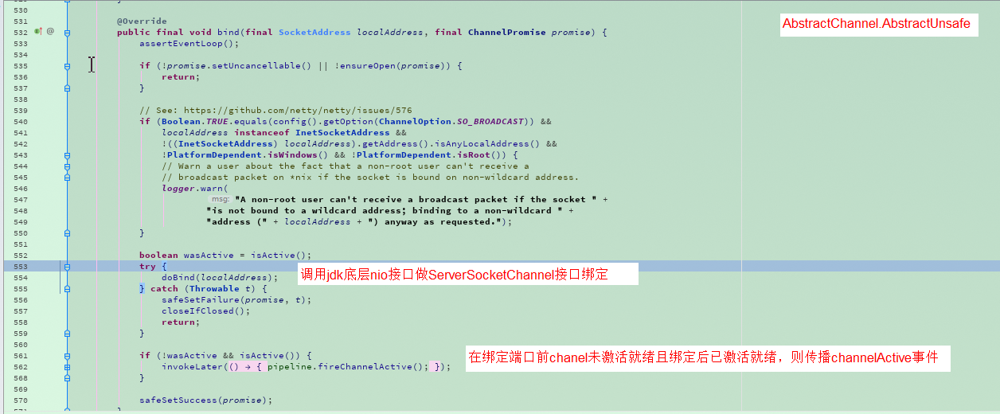
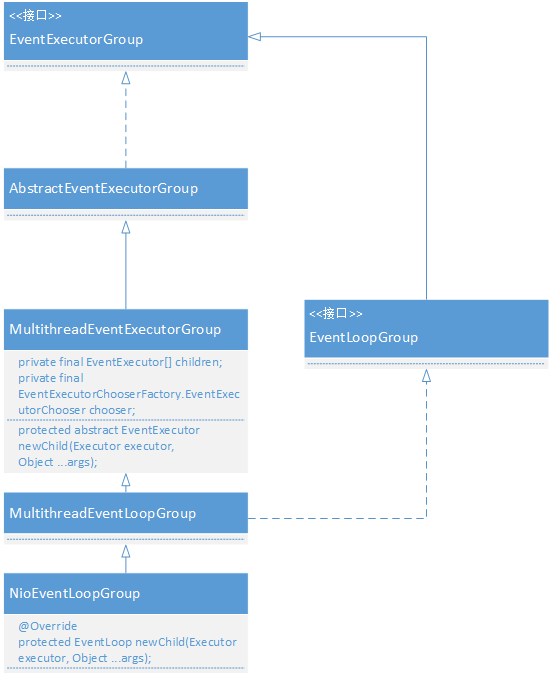
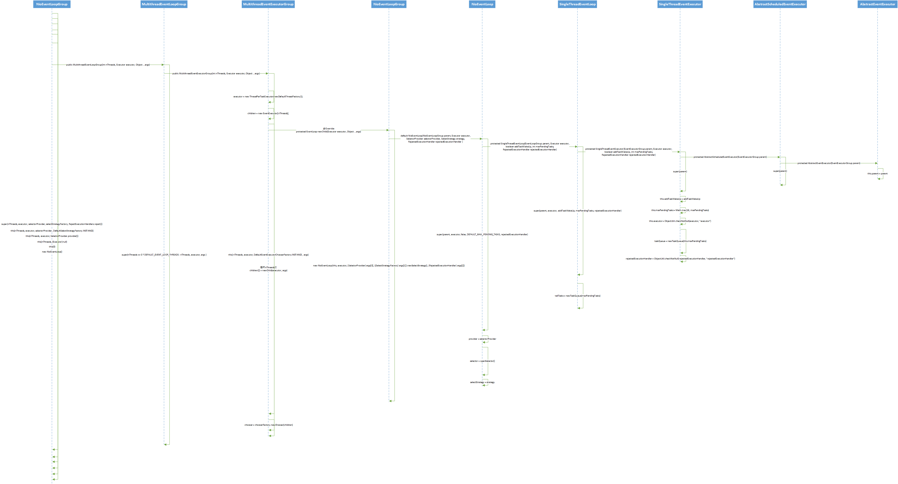
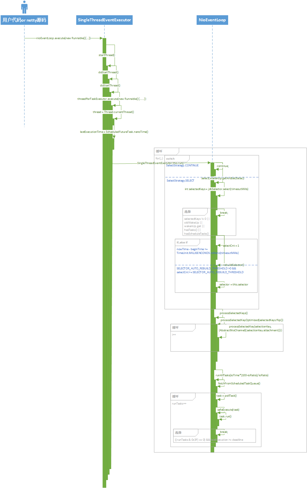
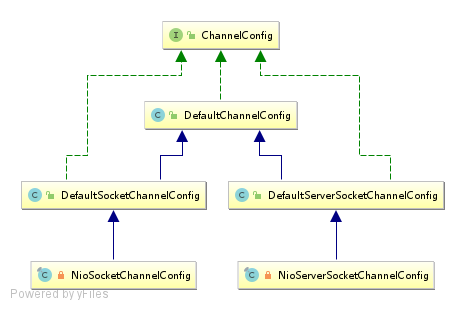

# netty的应用

- 

# Chapter-02

### Netty的基本组件

- NioEventLoop（核心）
  - Channel：netty自定义的Channel，是对nio中的Channel的进一步封装
    - Unsafe:用于实现每一种Channel的读写抽象
    - Pipeline:负责处理该Channel的数据处理业务逻辑链（将Channel的不同阶段、不同事件、handler等串联起来执行）
  - ChannelHandler：每一次Channel需要进行数据处理就放出一个ChannelHandler来进行处理，我们可以创建多个ChannelHandler对象添加到Channel里面去，从而介入Channel的数据处理流程中去。我们的业务代码也写在这里面。
  - ByteBuffer


# Chapter-03(服务端启动&服务端启动时干了什么)

### QuickStart-启动一个Netty服务端

```java
public class InboundChannelHandlerTestDemo {

    @Test
    public void server(){
        final EventLoopGroup serverGroup = new NioEventLoopGroup(1);
        final EventLoopGroup childGroup = new NioEventLoopGroup();
        try {
            ServerBootstrap b = new ServerBootstrap();
            b.group(serverGroup,childGroup)
                    .channel(NioServerSocketChannel.class)
                    // 对服务端Channel NioServerSocketChannel的配置，可通过多次调用设置多个
                    //.option()
                    //.option()
                    // 对服务端Channel NioServerSocketChannel的属性设置，可通过多次调用设置多个
                    //.attr()
                    //.attr()
                    //对accept到的SocketChannel的配置，每次accept到SocketChannel都会按照我们所传的配置项配置一遍
                    .childOption(ChannelOption.TCP_NODELAY, true)
                    //对accept到的SocketChannel的属性设置，每次accept到SocketChannel都会按照我们所传的属性设置一遍
                    .childAttr(AttributeKey.newInstance("childAttr"), "childAttrValue")

                    //为服务端设置ChannelHandler这里我们传入的是一个继承了ChannelInboundHandlerAdapter的自定义handler对象
                    //我们对于netty处理流程中接入一般都是在handler中实现，netty已经定义了基本的ChannelHandler接口、抽象类、以及众多实现类，
                    //我们既可以使用既有的ChannelHandler实现，亦可实现或继承自定义ChannelHandler。
                    .handler(new serverChannelHandler.ServerChannelInboundHandler())
                    //.handler(new ChannelInitializer<NioServerSocketChannel>() {
                    //    @Override
                    //    protected void initChannel(NioServerSocketChannel ch) throws Exception {
                    //        ch.pipeline().addLast()
                    //    }
                    //})

                    //为新连接设置ChannelHandler，我们如果要写业务代码一般也就是写在handler里面了。
                    //请注意：这是一个比较特殊的ChannelHandler抽象实现类，因为其本身并没有任何业务处理代码，当这个ChannelHandler的handlerAdded
                    //方法因fireHandlerAdded事件触发而被执行时，在handlerAdded方法中会调用initChannel(ChannelHandlerContext ctx)方法，
                    // 而在initChanel中会调用我们实现的initChanel(T ch)
                    //方法，然后这个特殊ChannelHandler再将自己本身从pipeline中移除，不再参与到后续的pipeline逻辑链的处理中来。
                    //因此我们可以看出这个ChannelHandler纯粹就是为了扩展自定义操作而生，自己本身没有任何作用
                    .childHandler(new ChannelInitializer<NioSocketChannel>() {
                        protected void initChannel(NioSocketChannel ch) throws Exception {
                            //可以在这这这里加上众多的handler介入对accept到的Channel的处理
                            //ch.pipeline().addLast()
                            //ch.pipeline().addLast()
                            //ch.pipeline().addAfter()
                        }
                    });

            //启动Netty服务端
            ChannelFuture channelFuture = b.bind(8848).sync();
            System.out.println("bind port sync over");
            //serverGroup.next().execute(() -> {
            //    System.out.println("test server eventLoop execute");
            //});
            channelFuture.channel().closeFuture().sync();
            System.out.println("channelFuture sync over");
        } catch (InterruptedException e) {
            e.printStackTrace();
        } finally {
            //优雅的关闭
            serverGroup.shutdownGracefully();
            childGroup.shutdownGracefully();
            //childGroup.shutdownGracefully(1000,3000, TimeUnit.MILLISECONDS);
        }
    }
}
```

### 服务端启动流程

- 服务端启动核心路径

```mermaid
sequenceDiagram
new Channel()->>init():then
init()->>register():then
register()->>doBind():then
```


##### 服务端Channel的创建

- 从外部用户代码进入到具体创建这一步的流程

  - ```mermaid
    sequenceDiagram
    bind()[用户代码入口]->>initAndRegister()[初始化并注册]:then
    initAndRegister()[初始化并注册]->>newChannel()[通过反射创建服务端channel]:then
    ```

- 具体创建的流程

  - newSocket()：通过jdk来创建底层jdk channel
    - .png)
  - AbstractNioChannel()
    - AbstractChannel()：创建id，unsafe，pipeline
    - SelectableChannel.configureBlocking(false)：jdk底层channel配置阻塞模式
    - .png)
  - new NioServerSocketChannelConfig()：tcp参数配置类。通过ServerBootstrap.option()保存的参数最终会被设置到此配置对象中去


##### 服务端Channel的初始化

- 从外部用户代码进入到具体初始化这一步的流程

  - ```mermaid
    sequenceDiagram
    bind()[用户代码入口]->>initAndRegister()[初始化并注册]:then
    initAndRegister()[初始化并注册]->>newChannel()[通过反射创建服务端channel]:then
    initAndRegister()[初始化并注册]->>init()[初始化服务端channel]:then
    ```

- 具体初始化Channel流程

  - init()：初始化入口
    - set ChannelOptions，set ChannelAttrs：将业务代码中用户配置的参数&属性设置到NioServerSocketChannel中去
    - pipeline.addLast(handler)：将用户配置的服务端handler加入pipeline处理逻辑链
    - childGroup、childHandler、childOptions、childAttrs：获取到对客户端Channel的各种配置，用来在后面第四步传入连接器中；childOptions主要是和弟底层tcp读写相关的配置，childAttrs主要是为了可以在channel上绑定一些自定义的属性，如该chanel的秘钥、存活时间之类的
    - add ServerBootstrapAcceptor：添加连接器（每次accept到SocketChannel后使用用户配置的childGroup、childHandler、childOptions、childAttrs作为其配置）
    - 源码：
      - .png)

##### 注册到selector

- 从外部用户代码进入到具体注册这一步

  - ``` mermaid
    sequenceDiagram
    bind()[用户代码入口]->>initAndRegister()[初始化并注册]:then
    initAndRegister()[初始化并注册]->>register()[将channel注册到selector]:then
    ```

  - 具体注册流程：

    - AbstractChannel.register(channel)：入口
      - this.eventLoop  =  eventLoop：绑定eventLoop，服务端对请求的接收轮询就是在通过此线程进行的，因此eventLoop是netty的核心
      - register0()：实际注册
        - doRegister()：调用jdk底层注册
        - invokeHandlerAddedIfNeeded()：回调执行handler中的handlerAdded(ChannelHandlerContext ctx)
        - fireChannelRegistered()：传播channel注册事件，可以让如我们添加的自定义handler感知
    - 部分源码流程：
      - 
      - 


##### 分配NioEventLoop

- 入口：initAndRegister()
  - config().group().register(channel)

##### 服务端口的绑定

- 从外部用户代码进入到具体绑定这一步

  - ``` mermaid
    sequenceDiagram
    bind()[用户代码入口]->>doBind0()[绑定并传播channelActive事件]:then
    ```

- 具体绑定步骤

  - AbstractChannel.AbstractUnsafe.bind()：入口
    - doBind()
      - javaChannel().bind()：调用jdk底层nio接口ServerSocketChannel绑定端口
    - pipeline.fireChannelActive()：传播channelActive事件，在传播的时候在头节点HeadContext节点的channelActive方法实现中会设置selectionKey的interestOps为OP_READ
  - 部分步骤源码：
    - 

# Chapter-04(NioEventLoop)

### 概述

- NioEventLoop是Netty的核心组件，运行时一切活动都在NioEventLoop中进行

### NioEventLoopGroup继承层级结构

- 

### NioEventLoop的继承层级结构

- 

### NioEventLoop创建时序图

- 

### NioEventLoop启动运行时序图




### NioEventLoop创建

- new **NioEventLoopGroup**(),默认创建cup核数*2个NioEventLoop，可在构造方法传入自定义
  1. 创建事件执行器-**EventExecutor**(即NioEventLoop，NioEventLoop是其实现类)数组
     - new EventExecutor[nThreads]数组，长度默认cpu核数*2
  
  2. 创建任务执行器-**ThreadPerTaskExecutor**
     - **用来启动线程，在这个线程中来启动运行NioEventLoop（SingleThreadEventExecutor.this.run()）**，并且将启动的这个线程绑定到NioEventLoop中（NioEventLoop的thread属性）
     - 每次execute(Runnable command)执行任务时，都会创建一个线程实体（FastThreadLocalThread，继承了Thread，对ThreadLocal做了优化）
     - 通过ThreadFactory来创建线程，每次创建一个NioEventLoopGroup对象时在NioEventLoopGroup的构造方法中会new 一个**DefaultThreadFactory**()传入到ThreadPerTaskExecutor构造方法中
     - 创建的线程名称命名规则nioEventLoop-nioEventLoop在nioEventLoop-1-xx（1：声明创建NioEventLoopGroup对象的次序，每创建一次自增1，xx：在每个DefaultThreadFactory对象中每创建一个线程自增1）
  
  3. 创建NioEventLoop对象
     - 循环前面创建的EventExecutor数组，通过newChild（threadPerTaskExecutor，args）创建出来的NioEventLoop对象赋值给每个数组元素
     - **newChild**
       - new NioEventLoop()
         - 将前面创建的ThreadPerTaskExecutor对象赋值到NioEventLoop对象的executor变量
         - 创建一个**MpscQueue**（Multi Producer Single Consumer Queue，多生产者单消费者，如果以服务端为主视角，那么服务端的NioEventLoop线程即Consumer，外部访问线程即Producer）队列，默认大小Integer.MAX_VALUE（可通过设置系统变量io.netty.eveltLoop.maxPendingTasks来自定义），赋值给NioEventLoop对象的taskQueue变量，这是一个优先队列PriorityQueue，NioEventLoop执行任务都是从此队列取
         - 创建Selector：通过SelectProvider对象.openSelector()来获取一个选择器，赋值给NioEventLoop对象的selector变量
  
  4. 创建NioEventLoop选择器：chooserFactory.newChooser()，用来在有外部请求时从NioEventLoop数组中挑选一个NioEventLoop来处理请求
     - isPowerOfTwo：NioEventLoop数组长度是否为2的n次幂，是则创建new PowerOfTwoEventExecutorChooser(executors)，否则创建new GenericEventExecutorChooser(executors)
       - PowerOfTwoEventExecutorChooser选择NioEventLoop规则：index++ & (length-1)
       - GenericEventExecutorChooser选择NioEventLoop规则：abs(index++ % length)

### NioEventLoop启动运行(for(;;)循环)

- 从哪里启动？
  - 在调用NioEventLoop.execute(task)执行任务时，首先判断是否inEventLoop()（NioEventLoop.thread == Thread.currentThread()），如果false，则startThread()（如果该NioEventLoop已绑定过thread则不再进行以下步骤）通过ThreadPerTaskExecutor启动一个线程，在线程中再SingleThreadEventExecutor.run()启动运行NioEventLoop，并在这个线程中将这个线程绑定到NioEventLoop（thread = Thread.currentThread()）

##### 检测是否有IO事件（for(;;)循环）-select()

- 在进行阻塞式selector.select()之前，需要先进行几项校验判断
  1. 校验设置的阻塞式select(timeoutMillis)的timeoutMillis是否小于0，小于0则break
  2. 校验任务队列taskQueue是否为空，如果不为空则设置wakenUp为true（表示上一次select仍为唤醒状态，必须先处理完任务队列中的任务才能进行下一次阻塞式selector.select()），并break
- 进行阻塞式select，int selectedKeys = selector.select(timeoutMillis)
  - 判断是否满足以下几种情况之一则break
    1. 监听到事件：selectedKeys不为0
    2. select正处于唤醒状态：oldWakenUp或者wakenUp为true
    3. 任务队列不为空：taskQueue不为空
    4. 定时任务队列不为空：scheduleTaskQueue不为空
- 判断线程是否被中断（Thread.interrupted()）,true则break，这是对一个issue fixed [issue 2426](// See https://github.com/netty/netty/issues/2426)
- 防止空轮询
  - 当满足以下两个条件时，就确认这一次select操作会一直是空轮询，然后rebuildSelector()（open一个新的selector替换掉NioEventLoop中的旧selector，然后将旧selector中注册的事件全部迁移注册到新的selector），然后break结束循环
    1. 当前事件减去开始时间如果比select(timeoutMillis)的阻塞时间timeoutMillis小的话，说明了没有阻塞那么长时间，没有进行阻塞式select，这是一次空轮询；
    2. 轮询的次数超过阈值SELECTOR_AUTO_REBUILD_THRESHOLD（默认512）

##### 处理IO事件-processSelectedKeys()

- 要处理IO事件，首先就先要拿到selectedKeys，说到selectedKeys，那就要看在前面创建NioEventLoop时，在openSelector()方法中对selectedKeys进行的初始化操作
  - 在openSelector方法中netty会将jdk中Selector底层的Set<SelectionKey> selectedKeys = new HashSet<>()以及publicSelectedKeys（基本等同于selectedKeys）替换为netty自己实现的一个类对象
  - netty自己实现的这个类**SelectedSelectionKeySet**继承AbstractSet，但是内部是通过数组实现的，为什么使用数组实现来替代HashSet实现呢？因为Selector底层对于selectedKeys只需要add操作，而不需要其他例如remove、contains、iterator实现，因此使用数组时的时间复杂度O(1)反而比使用HashSet实现时的时间复杂度O(n)低，性能更优
  - 在替换之前先判断DISABLE_KEYSET_OPTIMIZATION（关闭keyset优化）静态常量是否为false（默认为false），不为false时openSelector则直接返回selector
  - 通过反射的方式将选择器sun.nio.ch.SelectorImpl中的selectedKeys以及publicSelectedKeys这两个属性的值设置为netty自定义的SelectedSelectionKeySet对象
  - 将netty自定义的SelectedSelectionKeySet对象一并赋给NioEventLoop的selectedKeys属性
- processSelectedKeysOptimized(SelectionKey[] selectedKeyArr)：处理优化后的SelectedSelectionKeys
  - 入参为selectedKeys.flip()的返回值，即所有此时监听到的事件
    - 轮询入参 SelectionKey[]数组-for(;;)循环
      - processSelectedKey(SelectionKey,AbstractNioChannel)
        - 如果SelectionKey是非法的（！k.isValid()），关闭掉此channel：unsafe.close(unsafe.voidPromise());
        - 判断SelectionKey中监听到的是哪种事件（boss NioEventLoopGroup一般监听到的是ACCEPT事件，worker NioEventLoopGroup一般监听到的是READ事件）并进行相应处理（OP_ACCEPT：进行chapter-05新连接接入，OP_READ：进行数据读取）

##### 处理异步任务队列-runAllTasks(long timeoutNanos)

1. fetchFromScheduledTaskQueue()
   - 合并定时任务队列与普通任务队列：将定时任务队列scheduledTaskQueue（类型为PriorityQueue）中的到了定时时间的任务取出来移除并添加到普通任务队列taskQueue（MpscQueue）中去
   - 如果想要向定时任务队列中添加任务，我们需要通过先向普通任务队列中添加一个任务，在这个任务中再向定时任务队列中添加任务；为什么这样做？因为定时任务队列类型PriorityQueue是非线程安全的，而执行普通任务队列可以保证异步串行执行无锁化，从而达到线程安全
2. 执行task
   - for(;;) 死循环
     - 从taskQueue队列中取出task执行，task.run()（等于是直接执行Runnable的run方法）
     - 每循环64次检查一遍runAllTasks是否超时，超时则break
     - 检查从taskQueue队列中取出的是否为空，为空则break
3. afterRunningAllTasks()：执行tailTasks队列中的所有任务
4. this.lastExecutionTIme = lastExecutionTime：保存任务最后执行时间


### 三个问题

1. 默认情况下Netty服务端启多少线程？何时启动？
   1. 默认启动cpu核数*2个线程
   2. 服务端启动绑定端口会启动一个NioEventLoop（在parentGroup中选）；新连接接入通过chooser绑定一个NioEventLoop（在childGroup中选）
2. Netty是如何解决jdk空轮询bug的？
   1. 通过检查阻塞式select是否阻塞了传入的超时时间那么长，如果没有阻塞对应的超时时间那么长且轮询的次数超过设置的阈值SELECTOR_AUTO_REBUILD_THRESHOLD（默认512），此时就会rebuildSelector然后break循环
3. Netty如何保证异步串行无锁化？
   1. 通过将所有的操作包装成一个个task添加到任务队列，然后再依次执行任务队列中的任务，从而保证了异步串行无锁化


### 本章疑问？

1. NioChannel中的Unsafe是什么？与NioChannel有何关系？有何作用？
2. NioChannel中的Pipeline是什么？与NioChannel有何关系？有何作用？


# Chapter-05(新连接接入)

### 接入处理逻辑概述

1. 检测新连接
2. 创建NioSocketChannel
3. 分配NioEventLoop及注册selector
4. 监听channel的读（OP_READ）事件（netty的 “注册（register）” 都是先注册channel到selector然后再通过selectionKey.interestOps()来设置监听channel的什么事件）

### 检测新连接

- NioEventLoop.processSelectedKey(SelectionKey k, AbstractNioChannel ch)：是对chapter-04中处理IO事件循环的单次处理
  - 监听到OP_ACCEPT事件，进行相应处理：AbstractNioMessageChannel.NioMessageUnsafe.read()
    - RecvByteBufAllocator.Handler allocHandler = unsafe.recvBufAllocHandle();：用来控制每次read()可以接入的连接数
    - do...while循环：
      - 循环体：
        - doReadMessages(List<Object> buf)：通过jdk底层ServerSocketChannel来accept新连接并将获取到的jdk SocketChanel包装成netty自定义的NioSocketChannel
          - ch = javaChannel.accept()
          - new NioSocketChannel(this, ch)：this即NioServerSocketChannel
        - 如果doREadMessages返回的accept到的连接数小于0
        - allocHandler累加每次循环中doReadMessages()返回的accept到的连接数，totalMessages
      - 条件：allocHandler.continueReading()，同时满足以下四个条件
        - channelConfig.isAutoRead()：默认为true
        - totalMessages本次read累计接入的连接数小于每次read允许的最大接入连接数maxMessagePerRead（默认16）
        - 其余两个条件不重要
    - 传播事件fireChannelRead（accept到新连接有多少个就传播多少次）以及fireChannelReadComplete(一次)

### 创建NioSocketChannel

- 接上一步检测新连接中do...while循环体中的的doReadMessages中的new NioSocketChannel操作

- new NioSocketChannel(parent, ch)
  - 入参parent为服务端channel NioServerSocketChannel，ch为服务端jdk-channel accept之后获取到得到客户端channel
  - 初始化成员变量
    - Channel parent = parent
    - ChannelId id = newId()
    - Unsafe unsafe = newUnsafe()
    - DefaultChannelPipeline pipeline = newChannelPipeline()
    - SelectedableChannel ch = ch
    - int readInterestOp = OP_READ;保存要监听的事件
  - 配置channel为非阻塞模式：ch.configureBlocking(false)
  - 禁止Nagle算法
    - Nagle算法：尽量将小的数据包集合成大的数据包发送出去，这是jdk底层的
    - Netty为了及时将数据发送出去，降低延迟，禁止了Nagle算法
    - SocketChannelConfig config = new SocketChannelConfig(NioSocketChannnel channel, Socket javaSocket)
      - setTcpNoDelay(true)
  
- 思考：为什么服务端channel NioServerSocketChannel通过反射的方式创建而客户端Chanel NioSocketChanel确实通过new 构造函数的方式直接创建？

  1. 因为服务端chanel需要可以指定配置channel实现类class来创建不同类型的服务端channle对象

  2. 因为通过反射创建速度较慢，而服务端channel是在服务启动的时候创建的，所以不关心速度问题；

     客户端channel创建需要响应速度，因此直接通过构造函数的方式创建

### Channel的分类

- channel总的来说可以分为两大类：客户端channel、服务端channel
- 不同点
  - 在selector中监听的事件不同
  - Unsafe不同：Unsafe主要用于实现每一种channel的读写抽象
    - 客户端channel中，“read”是指读取IO数据
    - 服务端channel中，“read"是指获取新连接
  - ChannelConfig不同
- 相同
  - Pipeline：负责处理该channel的数据处理业务逻辑链
- Channel类图
  - 
- ChannelConfig类图
  - 

### ServerBootstrapAcceptor

- pipeline中逻辑链的执行的执行主体为ChannelHandlerContext的实现类，所有添加进pipeline中的ChanelHandler都是被包装成ChannelHandlerContext作为执行链中的一个节点，然后通过其next及prev这两个属性将所有添加进去的ChannelHandler串联起来，next一个个迭代执行
- 而在pipeline创建的时候就会有两个ChannelHandlerContext被创建并被赋给其全局变量head、tail，后续每次执行逻辑链都是从head这个ChannelHandlerContext开始，通过递归next一个个执行ChanelHandlerContext，到最后的tail这个ChannelHandlerContext时，其next值为空就结束

- ServerBootstrapAcceptor，在fireChannelRead事件被触发后会执行到逻辑链中的这一个ChannelHandler的channelRead方法
  - 添加childHandler
  - 设置options和attrs
  - 从NioEventLoopGroup中选择一个NioEventLoop分配给NioSocketChannel并注册selector
  - 触发fireChannelActive事件，在HeadContext的channelActive方法实现中会设置selectionKey的interestOps为OP_READ


### 两个问题

1. Netty是在哪里检测有新连接接入的？
   1. 在boss线程检测到IO事件之后的处理IO事件中检测是否有新连接接入
2. 新连接是怎样注册到NioEventLoop线程的？
   1. 通过chooser选择一个NioEventLoop，然后将客户端channel注册到该NioEventLoop中的selector选择器中


### 本章疑问？

- ChannelPromise是什么？作用是什么？用于何处？
- ChannelFuture是什么？作用是什么？用于何处？
- pipeline是如何添加handler至其逻辑链的；pipeline是如何执行其逻辑链的？pipeline主要可以应用在那些地方？


# Chapter-06(Pipeline)

### 概述

- pipeline中所说的**逻辑链**实质上是一个**双向链表的结构**，固定以Pipeine.HeadContext开头，以Pipeline.TailContext结尾，中间的链表元素则是我们添加进去的经过包装后(ChannelHandlerContext)的ChannelHandler
- 每一个节点元素对象都有next、prev这两个属性，从而形成双向链表
- 

### 关键类类图

##### ChannelInboundHandler接口

##### ChannelOutboundHandler接口

##### AbstractChannelHandlerContext

##### DefaultChannelPipeline.HeadContext

##### DefaultChannelPipeline.TailContext


### 主要的几个类之间的联系及其作用

##### Pipeline

- 如果想要**完整**的执行一条handler链的话，就需要通过pipeline来作为入口，从头或者从尾（看触发的是inbound事件还是outbound事件）开始执行。

##### ChannelHandler

- channelHandler是逻辑链中每一个节点其事件触发后的实际执行者
- 大体上分为两类InboundHandler、OutboundHandler，分别对应着inbound事件的处理、outbound事件的处理
- **ChannelHandler.@Sharble**注解：被添加到pipeline的channelHandler会检查其类是否被@Sharable注解修饰，若没有，则一个pipeline中同一个handler对象只能被添加一次，否则会抛出异常

##### ChannelHandlerContext

- 逻辑链中的每一个节点
- 在逻辑链中起到事件传播的作用，从而使事件得以传播到下一（上一）个节点
- 是对ChannelHandler的包装；在pipeline.addxxx添加ChannelHandler的时候，回在addxxx方法内部创建ChannelHandlerContext对象将ChannelHandler设置进其handler属性，并且通过instanceof关键字判断ChannelHandler是InBoundHandler还是OutboundHandler，进而设置ChannelHandlerContext对象的inbound与outbound这连个布尔属性值

##### HeadContext

- 是Pipeline中的一个内部类
- 其inbound属性为false，outbound属性为true，因此这是一个处理outbound事件的handler
- 实现了ChannelHandlerContext与ChannelHandler两个接口，因而其既具有传播事件的功能又具有事件触发后实际执行者的功能

##### TailContext

- 是Pipeline中的一个内部类
- 其inbound属性为true，outbound属性为false，因此这是一个处理inbound事件的handler
- 实现了ChannelHandlerContext与ChannelHandler两个接口，因而其既具有传播事件的功能又具有事件触发后实际执行者的功能

### Inbound事件与Outbound事件

|        | Inbound                                                      | Outbound                                                     |
| ------ | ------------------------------------------------------------ | ------------------------------------------------------------ |
| 相同点 |                                                              |                                                              |
| 不同点 | 如果通过pipeline触发的inbound事件，会从head开始往后          | 当通过pipeline触发outbound事件时，汇总tail开始往前传播       |
|        | inbound事件都是一些被动型的事件，大都是netty内部触发的，如channelActive、channelRead等事件 | outbound事件大都是一些主动型事件，大都是用户代码中去主动触发的，如write等事件 |


### 异常的传播

- 从出现异常的当前handler节点开始往后传播，整条链路中不管是inbound类型的handler还是outbound类型的handler都能接收到


### 三个问题

- netty是如何判断ChannelHandler类型的？
  - 我们在往pipeline中添加channelHandler的时候，会通过instanceof关键字判断是InBoundChannelHandler还是OutBoundChannelHandler，并在随后将ChannelHandler包装成ChannelHandlerContext对象的时候，在其中设置inBound和outBound两个布尔属性值
- 对于ChannelHandler的添加应该遵循什么样的顺序？
  - InBound事件的传播与用户代码中添加InBoundChannelHandler的顺序正相关，OutBound事件的传播与用户代码中添加OutBoundHandler的顺序负相关
- 用户手动触发事件传播，不同的触发方式有什么样的区别？
  1. 触发方式一：通过pipeline手动触发；此种方式触发会将pipeline中的整条逻辑链执行一遍，如果是InBound事件会从head节点开始，正序执行逻辑链上的所有InBoundChannelHandler；如果是OutBound事件会从tail节点开始，逆序执行逻辑链上的所有OutBoundChannelHandler
     1. ex: channelHandlerContext.pipeline().fireChannelRead(msg);
  2. 触发方式二：通过逻辑链中的某个节点手动触发；如果是InBound事件，此种方式的事件执行起始点为下一节点开始，正序执行逻辑链上的InBoundChannelHandler直到尾部；如果是OutBound事件，此种方式的事件执行起点为上一节点，逆序执行逻辑链上的OutBoundChannelHandler直到头部
     1. ex: channelHandlerContext.fireChannelRead(msg)